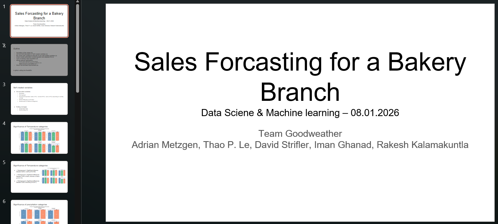

# Bakery Sales Prediction - Team 13 Goodweather

## Repository Link

[https://github.com/DavidStrif/team3_goodweather]

## Description

This repository is our first project towards Machine Learning. By developing a regression-model and a neural net we try to predict the revenues of a bakery. 
The model is trained on data over a period of 7 years (01.07.2013 - 31.07.2018).
The structure used in this and other Readmes might not fit the progress of our work. All files/notebooks are there however. Please just check our repo.

### Task Type

The task is done using a regression analysis and a neural net to predict the values.

### Results Summary

#### Best Model Performance
- **Best Model:** neural_net_estimation_3.0.ipynb
- **Evaluation Metric:** Primary metric used: MAPE-Score
- **Final Performance:** Best score achieved: MAPE = 20.26 %

#### Model Comparison
- **Baseline Performance:** R2 = 0.7094  MAPE = 31.78 %
- **Improvement Over Baseline:** 10% reduction in MAPE
- **Best Alternative Model:** neural_net_estimation_2.0.ipynb, MAPE = 21,157 %

#### Key Insights
- **Most Important Features:** In our regression model the hot encoded warengruppen showed the highes impact. From our self created variables the holliday was the strongest feature.
- **Model Strengths:** The prediction could be improved by changing the tuning parameters by quite a lot and even the weaker versions easily outperform our baseline model.
- **Model Limitations:** The quality of the features themselves could be improved. The significance of most features was not highly significant so our model is bounded by that. When comparing the observed data to our prediction it needs to be mentioned that for single days our model forecasts quite low values.
- **Business Impact:** [Practical implications of the model performance]

## Documentation

1. **[Literature Review](0_LiteratureReview/README.md)**
2. **[Dataset Characteristics](1_DatasetCharacteristics/notebooks/03_feature_engeneering.ipynb)**
3. **[Baseline Model](2_BaselineModel/linear_regression.ipynb)**
4. **[Model Definition and Evaluation](3_Model/neural_net_estimation_1.0.ipynb)**
5. **[Presentation](4_Presentation/README.md)**

## Cover Image

